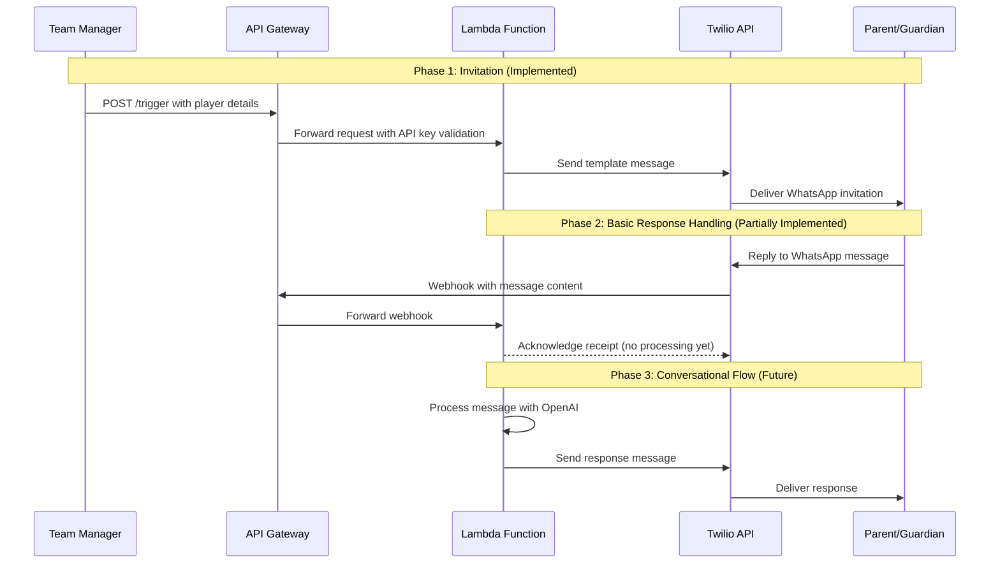

# Urmston Town WhatsApp Bot - Registration Flow Diagram

## Registration Process Description

### Phase 1: Invitation (Implemented)
- Team Manager initiates the registration process by sending player details to the `/trigger` endpoint
- API Gateway validates the API key
- System sends a WhatsApp template message to the parent/guardian with registration information

### Phase 2: Basic Response Handling (Partially Implemented)
- Parent/Guardian responds to the WhatsApp message
- Twilio sends a webhook to our API with the message content
- System acknowledges receipt of the webhook but does not process the message yet

### Phase 3: Conversational Flow (Future)
- System will process incoming messages using OpenAI
- System will send appropriate responses based on the conversation context
- Parent/Guardian will receive personalized responses

### Technical Implementation
- Twilio WhatsApp Business API for messaging
- AWS Lambda for serverless processing
- AWS API Gateway for HTTP endpoints with API key authentication
- AWS Secrets Manager for secure credential storage
- SSM Parameter Store for configuration
- OpenAI integration (planned for Phase 3)
- SQS Queue for webhook message buffering (planned for Phase 3)
  - Will provide message reliability during high traffic
  - Enables asynchronous processing of incoming messages
  - See `docs/phase3/sqs_integration_plan.md` for details
