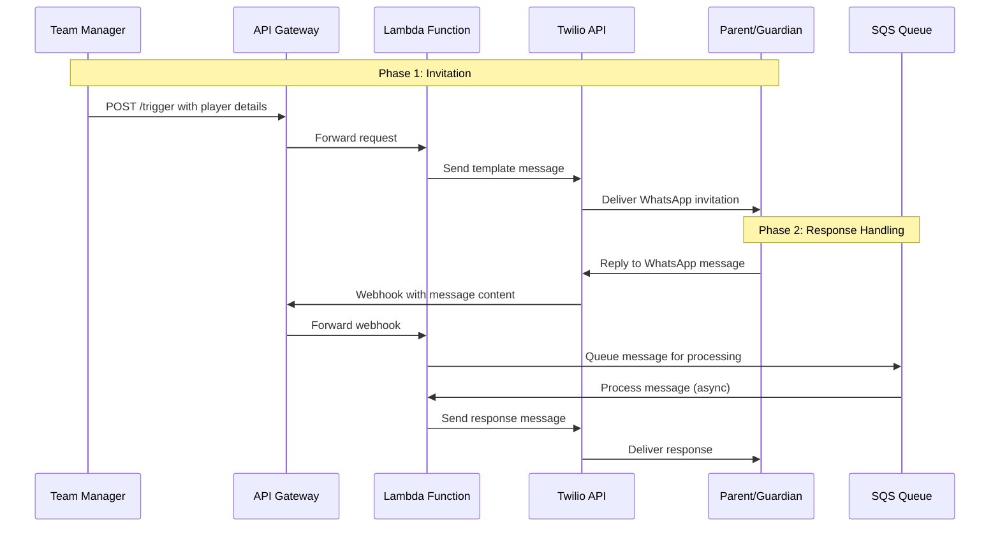

# Urmston Town WhatsApp Bot - Registration Flow Diagram

## Registration Process Description

### Phase 1: Invitation
- Team Manager initiates the registration process by sending player details to the `/trigger` endpoint
- System sends a WhatsApp template message to the parent/guardian with registration information

### Phase 2: Response Handling
- Parent/Guardian responds to the WhatsApp message
- Twilio sends a webhook to our API with the message content
- System queues the message for processing
- System processes the message and sends a response
- Parent/Guardian receives the response message

### Technical Implementation
- Twilio WhatsApp Business API for messaging
- AWS Lambda for serverless processing
- AWS SQS for message queuing
- AWS API Gateway for HTTP endpoints
- AWS Secrets Manager for secure credential storage
