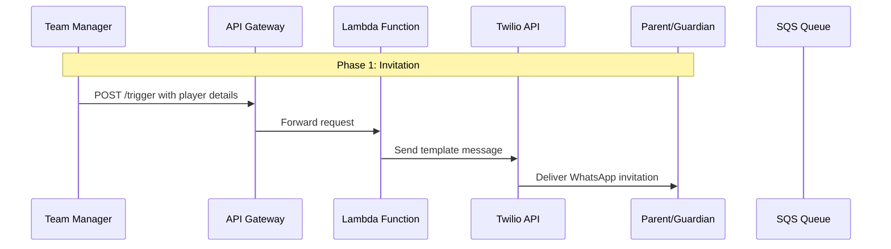

# Urmston Town WhatsApp Bot - Registration Flow Diagram

## Registration Process Description

### Phase 1: Invitation
- Team Manager initiates the registration process by sending player details to the `/trigger` endpoint
- System sends a WhatsApp template message to the parent/guardian with registration information
