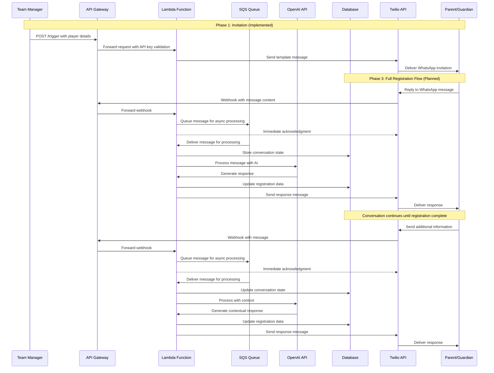

# Urmston Town WhatsApp Bot - Future Registration Flow Diagram

## Future Registration Process

This diagram illustrates the planned full registration flow that will be implemented in Phase 3, including:

1. **SQS Queue Integration** for reliable message handling:
   - Buffers incoming webhook messages during high traffic
   - Enables asynchronous processing
   - Ensures no messages are lost
   - Provides immediate response to Twilio

2. **OpenAI Integration** for intelligent conversation handling:
   - Processes messages with context awareness
   - Generates appropriate responses
   - Guides users through the registration process

3. **Database Storage** for:
   - Conversation state tracking
   - Registration data persistence
   - Player information management

The system will maintain context throughout the conversation, allowing for a natural registration experience where parents can provide information incrementally and receive appropriate guidance at each step.

For more details on the SQS integration plan, see `docs/phase3/sqs_integration_plan.md`.
