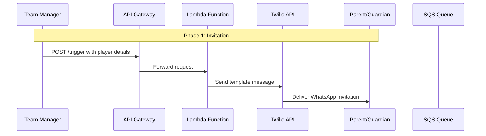

# Urmston Town WhatsApp Bot - Registration Flow Diagram

```mermaid
sequenceDiagram
    participant TM as Team Manager
    participant API as API Gateway
    participant Lambda as Lambda Function
    participant Twilio as Twilio API
    participant Parent as Parent/Guardian
    participant SQS as SQS Queue
    
    Note over TM, Parent: Phase 1: Invitation
    TM->>API: POST /trigger with player details
    API->>Lambda: Forward request
    Lambda->>Twilio: Send template message
    Twilio->>Parent: Deliver WhatsApp invitation
```

