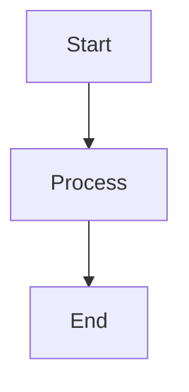

# Test Mermaid Diagram

This is a simple test to check if GitHub's Mermaid renderer is working.

If you can see a simple flowchart above with three boxes connected by arrows, then Mermaid is working correctly.
